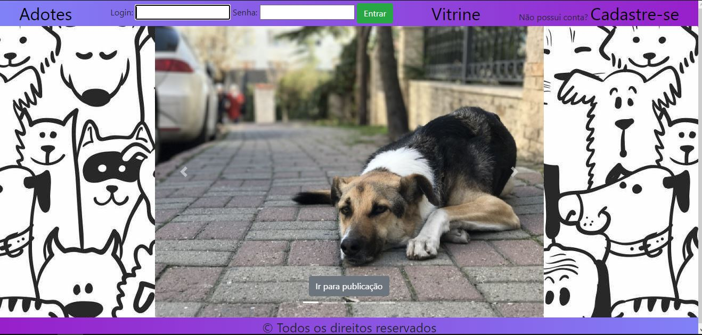
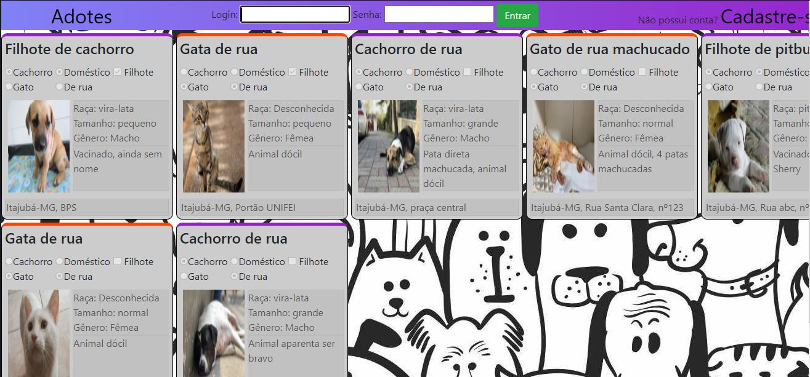
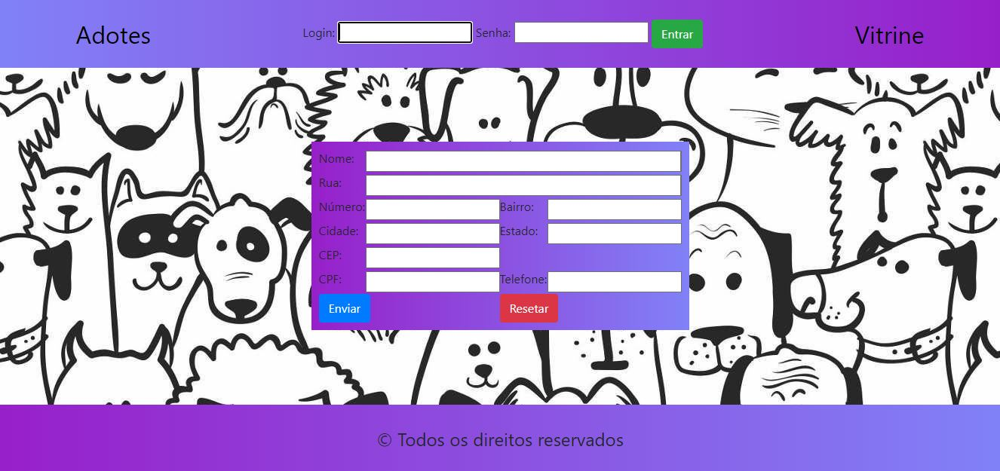
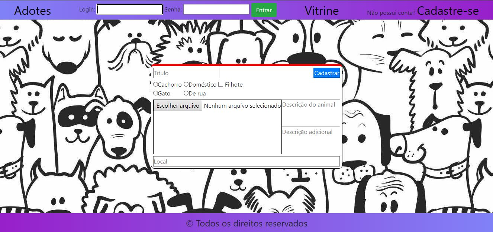

# Adotes
Site fictício para adoção de cachorros e gatos de rua, e filhotes cujos donos queiram doar.

Tecnologias usadas: HTML, CSS, Javascript e Bootstrap

Ao entrar no site, o usuário se depara com a página inicial

No canto superior direito tem-se a opção "Vitrine", onde será mostrado todos os animais cadastrados no sistema que ainda não foram adotados.

Mas para que o usuário possa fazer o cadastro de animais e entrar em contato com quem divulgou algum, deve-se fazer o cadastro no sistema e fazer login.

Depois de logado, será exibido para o usuário os dados de contato de quem fez alguma publicação (para algum animal doméstico que o dono esteja querendo doar seus filhotes, por exemplo), e também poderá fazer o cadastro de algum cachorro ou gato, preenchendo o formulário.

Para ir à aplicação no GitHub Pages, acesse
https://gustas01.github.io/Adotes/
